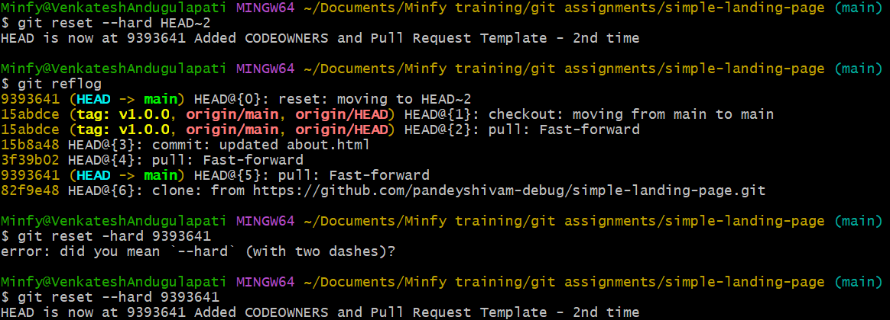
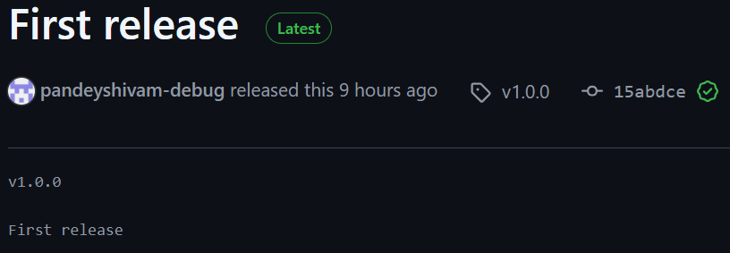

# Collaborative Project with Advanced Git Techniques

## Team Structure
Team Size: 3 Members  

Project: Simple Portfolio Website  

Branching Strategy: GitHub Flow  

Main Components:  

* Home Page
* About Page
* Contact Page

## Authors

[Priyesh Rai](https://github.com/PriyeshRaiMinfy), 
[Uzaif Ali](https://github.com/Uzaif-Minfy), 
[Shivam Kumar Pandey](https://github.com/pandeyshivam-debug)

## Branching Strategy
We used **GitHub Flow**, where each feature is developed in separate branches and merged to `main` via PR

## Team Collaboration
Each member worked on different components. We used a GitHub project board and issues for task tracking.

## Each team member works on different features simultaneously  

## Advanced Git Techniques Used
- **Interactive Rebase** to squash and clean up commits  

  
   

- **Cherry-pick** to reuse code    

  

- **Git Bisect** to debug  

  

- **Reflog** to recover lost work  
  

- **Tags** and **Releases** for versioning  

 

- **Code Reviews** via GitHub UI
